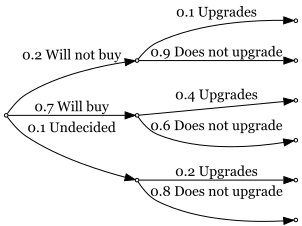

### 6. An email message can travel through one of three server routes. The percentage of errors in each of the servers and the percentage of messages that travel through each route are shown in the following table. Assume that the servers are independent.

    s1 = 0.4
    s2 = 0.25
    s3 = 0.35

    s1error = 0.01
    s2error = 0.02
    s3error = 0.015

1.  What is the probability of receiving an email containing an error?

<!-- -->

    # Get the total probability of errors
    total_error = (s1*s1error) + (s2*s2error) + (s3*s3error)

    cat("The probability of receiving an email containing an error is", round(100*total_error, 2), "%.")

    ## The probability of receiving an email containing an error is 1.43 %.

1.  What is the probability that a message will arrive without error?

<!-- -->

    no_error = 1 - total_error
    cat("The probability of receiving an email without an error is", round(100*no_error, 2), "%.")

    ## The probability of receiving an email without an error is 98.58 %.

1.  If a message arrives without error, what is the probability that it
    was sent through server 1?

<!-- -->

    s1no_error = (s1*(1-s1error))/no_error
    cat("The probability of receiving an email from server 1 given that it is without error is",  
        round(100*s1no_error, 2), "%.")

    ## The probability of receiving an email from server 1 given that it is without error is 40.17 %.

### 9. A software company surveyed managers to determine the probability that they would buy a new graphics package that includes three-dimensional graphics. About 20% of office managers were certain that they would not buy the package, 70% claimed that they would buy, and the others were undecided. Of those who said that they would not buy the package, only 10% said that they were interested in upgrading their computer hardware. Of those interested in buying the graphics package, 40% were also interested in upgrading their computer hardware. Of the undecided, 20% were interested in upgrading their computer hardware.

Let A denote the intention of not buying, B the intention of buying, C
the undecided, and G the intention of upgrading the computer hardware.

    A = 0.2
    B = 0.7
    C = 0.1

    # with intention of upgrading
    G_a = 0.1
    G_b = 0.4
    G_c = 0.2

1.  Calculate the probability that a manager chosen at random will not
    upgrade the computer hardware (P(G\_bar)).

<!-- -->

    # Total probability that a manager WILL upgrade
    G = (A*G_a) + (B*G_b) + (C*G_c)

    # Total probability that a manager will NOT upgrade
    G_bar = 1-G
    cat("Total probability that a manager chosen at random will not upgrade or P(G_bar) is",  
        round(100*G_bar, 2), "%.")

    ## Total probability that a manager chosen at random will not upgrade or P(G_bar) is 68 %.

1.  Explain what is meant by the posterior probability of B given G,
    P(B|G).

<!-- -->

    # First, use Bayes' rule to calculate P(B|G) given by the formula P(B|G) = (P(B)P(G|B))/P(G).
    B_g = (B*G_b)/G
    cat("The result is", B_g, "or", round(100*B_g, 2), "%.")

    ## The result is 0.875 or 87.5 %.

This means that if you randomly chose from all the managers who want to
upgrade their hardware (given G), the probability that the manager you
chose wants to buy the graphics card (B) or P(B|G) is 87.5%.

1.  Construct a tree diagram.

<!-- -->

    tree_diagram = "
    digraph probability_tree {

      graph [layout = dot, rankdir = LR]
      node [shape = point, style = filled, fillcolor = white]
      
      A [label = 'Office Managers']
      
      B [label = 'Will not buy']
      C [label = 'Will buy']
      D [label = 'Undecided']
      
      E1 [label = 'Upgrades']
      E2 [label = 'Does not upgrade']
      
      F1 [label = 'Upgrades']
      F2 [label = 'Does not upgrade']
      
      G1 [label = 'Upgrades']
      G2 [label = 'Does not upgrade']
      
      A -> B [label = '0.2 Will not buy']
      A -> C [label = '0.7 Will buy']
      A -> D [label = '0.1 Undecided']
      
      B -> E1 [label = '0.1 Upgrades']
      B -> E2 [label = '0.9 Does not upgrade']
      
      C -> F1 [label = '0.4 Upgrades']
      C -> F2 [label = '0.6 Does not upgrade']

      D -> G1 [label = '0.2 Upgrades']
      D -> G2 [label = '0.8 Does not upgrade']

    }
    "
    svg_output <- DiagrammeR::grViz(tree_diagram)

    svg_file <- tempfile(fileext = ".svg")
    DiagrammeRsvg::export_svg(svg_output) %>% 
      writeLines(svg_file)

    rsvg::rsvg_png(svg_file, "tree_diagram.png")

    

Calculate the following probabilities: P(G), P(B|G), P(B|G\_bar),
P(C|G), P(C\_bar|G\_bar)

    # Total Probability
    P_G = (0.2*0.1) + (0.7*0.4) + (0.1*0.2)
    P_G

    ## [1] 0.32

    # Bayes' Rule
    P_B_given_G = (0.7*0.4)/P_G
    P_B_given_G

    ## [1] 0.875

    P_B_given_G_bar = (0.7*0.6)/(1-P_G)
    P_B_given_G_bar

    ## [1] 0.6176471

    P_C_given_G = (0.1*0.2)/P_G
    P_C_given_G

    ## [1] 0.0625

    P_C_bar_given_G_bar = (0.2*0.9)/(1-P_G) + (0.7*0.6)/(1-P_G)
    P_C_bar_given_G_bar

    ## [1] 0.8823529

And so:  
P(G) = 0.32 or 32%  
P(B|G) = 0.875 or 87.5%  
P(B|G\_bar) = 0.6176 or 61.76%  
P(C|G) = 0.0625 or 6.25%  
P(C\_bar|G\_bar) = 0.8824 or 88.24%

### 13. A malicious spyware can infect a computer system though the Internet or through email. The spyware comes through the Internet 70% of the time and 30% of the time, it gets in through email. If it enters via the Internet the anti-virus detector will detect it with probability 0.6, and via email, it is detected with probability 0.8.

    via_net = 0.7
    via_mail = 0.3

    detected_net = 0.6
    detected_mail = 0.8

1.  What is the probability that this spyware infects the system?

<!-- -->

    # Total probability that the spyware gets detected
    detected_total = (via_net*detected_net) + (via_mail*detected_mail)

    # Total probability that the spyware infects the system
    infects_total = 1-detected_total
    cat("The probability that the spyware infects the system is", round(100*infects_total, 2), "%.")

    ## The probability that the spyware infects the system is 34 %.

1.  If the spyware is detected, what is the probability that it came
    through the Internet?

<!-- -->

    # Probability the spyware came through the internet given that the spyware is detected or 
    # P(A|X) where A is the internet and X is the detection
    P_A_given_X = (via_net*detected_net)/detected_total
    cat("The probability that the spyware came through the internet given that it is detected is",  
        round(100*P_A_given_X, 2), "%.")

    ## The probability that the spyware came through the internet given that it is detected is 63.64 %.

Github Link:
<https://github.com/SylTana/APM1110-QUIJANO-JULIAN_PHILIP/tree/main/FA5>
