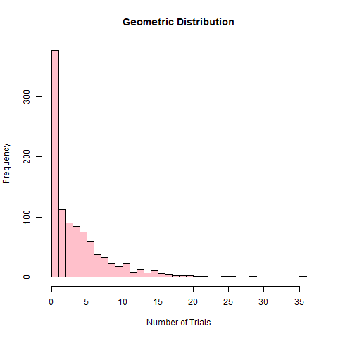

### I. Geometric Distribution. Provide an R code for the geometric distribution. The geometric distribution is a probability distribution that models the number of trials required to achieve the first success in a sequence of Bernoulli trials, where each trial has a constant probability of success.

1.  Set the probability of success: p &lt;- 0.2

<!-- -->

    p = 0.2

1.  Generate 1000 random variables from the geometric distribution.

<!-- -->

    x = rgeom(n = 1000, prob = p)
    x

    ##    [1]  2  4 11  5 11  2 10  2  4  6  1  0  0  1  6 10 16  3  2  1  2  2  0  5
    ##   [25]  1  1  2  3  1  0  1  0  4  0  1  7  4  0  0  9  7  3  8  3  1  4  0  0
    ##   [49]  2  1  0  3  5  0  0  3  0 26 12  2  0  4  9  1  0  4  7  4  5  1  6  8
    ##   [73]  5  5  0  3 10  2  3  5  1  5  8  0  7  6  3  0  0  0  1  7  1  5  5  5
    ##   [97]  3  5  9  2  0  1  9  3  1  1  9  3  3  7  0  0  4  0  4  0 11  0  7  1
    ##  [121]  0  1  3  6  3  1  2  1 17 20 22  0  0 14  5  1  0  2  1 42  0  2  0  1
    ##  [145]  6  5  2  1  2  1  0  2  1  1  2  8  5  3  3  1 11  5  1  7  1  4  4 15
    ##  [169]  0 20  6 10  0  0  6  0  0  1  5  2 11  6  2  3  1  7  0  3 10  2  3  1
    ##  [193] 20  0  3  0 24  5  2  0  3  1  1  6  4  3  0  3  0  1  3  3  1  1  1  5
    ##  [217]  2  1  3  0  3  6 10  6  0  2  5  0  0  1  1  8  5  8  4  3  2 17  1  1
    ##  [241]  9  1  7  4  5  2  1  6  8 12  0  0  1  8  6  0  8  1  9  3  1  9  4  7
    ##  [265] 19  0  7  1  1  5  1  5  3  1  1  8  0  2  7  1  0  6  2 10  0  3  0  1
    ##  [289]  1  0  5  2  6  5 16  3  0  6  1  1 18  8  3  3  6  1  0  1  6  2  3  0
    ##  [313] 11  3  8  4  0  8  4 10  0  2  1  2  5  1 10  3  3  4  1  4  0  1  1 14
    ##  [337] 10  3  3  2  2  4  3  4  7  3  7  1  4  7  2  0 13  3  4  7  1  0  4 17
    ##  [361]  1  2  0  0  4  8  1  5  6  0  2 20  7  6  3  3  2 10  2  7  1  2  6  0
    ##  [385]  5  0 11  6  2  0  4  0  1  1  2  9  2  7  3 11  1 14 24  0  4  2  2  2
    ##  [409]  1  5  1  3  0  1  4 13  6  1  9  1  2  4  2  1  2  0  9  1  4  5  2  3
    ##  [433]  4  0  2 13 10 22  1  3  4  0  2  1  2  1 13 12  0  7  1  0  0 11  6  6
    ##  [457]  1  1  3  1  1  1 10  1  2  1  8  8  4  4  1  1  6  8  9 11  0  2 10  6
    ##  [481]  0 10  1  3  0  0  2  0  6  1  2  0  3  0  1  2  0  1  2  1  3  4  7 26
    ##  [505]  0  0  5  2  5  6 10 10  9  5  4  0  3  5  2  1  3  0  0  9 11  5  2  0
    ##  [529]  4  0  3  0 11  5  9  2  0  0  1  4  1  0  4  3  1  1  1  8  1  2  8  2
    ##  [553]  4  3  4  2 13  6  3  1  1  2  1  0  6  3  1  1  5  1  2  1  0  4  1  4
    ##  [577]  3  2  1  4  0  6  2  1  3  1  3  2  1 10  3  2  2 12  8  0 16  2  5  3
    ##  [601]  0  0  2  3  4  7  2  4  7  0  6  4  8  0  1  4  1  0  5  3  0 10  6  0
    ##  [625]  2  0  1  0  3 14  1  2  3  1  1 15  0  6  2  1  4  2  5  0  2  3  1  4
    ##  [649]  0  1  1  0  1  7  7  1 18  8  6  3 11  0  2 18  0  2  1  6  6  7  1  6
    ##  [673]  4  1  5  2  1  2  8  0  0  0 11 12  0  0  0  1 14  0  2  1  6  3  4  2
    ##  [697]  0 10  1  3  1  5  1  1  0 14  7  0  1  0  1  0  2  5  9  0  4  5  0  3
    ##  [721]  9 10  2  7  1  1  2  7  2  0  8  0  0  0  3  8  5  0  2  7 11  0  6 10
    ##  [745] 14  1  2  9  8  5 10  2 11  0  5 25  2  7  0 12  9  8 10  3  5  0  1  1
    ##  [769]  0  4  0  0  2  3  3  1  2  1 17 11  3  2  0  0  5  5  4 10 11  7  1  3
    ##  [793]  2  0  4  2  2  2  4  5  0  6  4  0  4  7  1 10  3  2  1  7  5 13 19  8
    ##  [817]  3  0  7  8  0  1  7  0  0  0  0  7  5  2  1  6 10  2  0  7  4  0  7  1
    ##  [841]  3  0  4  0 11  4  4  6  4  2  0  4  7  4 15  5 16  6  3  3  0  6  1  5
    ##  [865]  4  4  4  1 10  4  3  1  8  7 20  8  8 24  0  6  7  2  5 10 12  1  2 11
    ##  [889]  8  2  0  5  1  4  1 11  3  0  7  0  2  2  2  1  5  4  2  6  2  9  2  1
    ##  [913]  2 17  7  4  6 10 16  1  2  1  2  1 11  6  3 16 12  0  0  0  3  2  5  1
    ##  [937]  6  1  8  2  0  2  6  2  0  0  0  2  0  8  8  0  6  1  5  4 10  3  8  0
    ##  [961]  5  4  1  7  1 10  1  4  1  1  4  5  8  4  1  1  2  2 10  3  2  5 14  5
    ##  [985]  0  0  4  3 16  4  4 10  0  1  2  1  3  2  0  5

1.  Calculate some basic statistics:

<!-- -->

    mean_x = mean(x)

    var_x = var(x)

    sd_x = sd(x)

1.  Print the results in item 3 with the following output (string):

Number of trials required to achieve first success:

Mean (in 2 decimal places):

Variance (in 2 decimal places):

Standard deviation ( in 2 decimal places):

    cat("Number of trials required to achieve first success:\n" )

    ## Number of trials required to achieve first success:

    cat("Mean (in 2 decimal places):", round(mean_x, 2), "\n")

    ## Mean (in 2 decimal places): 4.04

    cat("Variance (in 2 decimal places):", round(var_x, 2), "\n")

    ## Variance (in 2 decimal places): 20.26

    cat("Standard deviation ( in 2 decimal places):", round(sd_x, 2), "\n")

    ## Standard deviation ( in 2 decimal places): 4.5

1.  Plot the histogram of the results.

<!-- -->

    hist(x, breaks = 30, main = "Geometric Distribution", 
         xlab = "Number of Trials", col = "pink")

### II. Hypergeometric Distribution. Consider a plant manufacturing IC chips of which 10% are expected to be defective. The chips are packed in boxes for export. Before transportation, a sample is drawn from each box. Estimate the probability that the sample contains more than 10% defectives, when:

1.  A sample of 10 is selected from a box of 40;

<!-- -->

    N = 40 # Total Population
    K = 4 # 10% expected to be defective
    n = 10  # Sample

    # We want to find P(X > 1) which is = 1 - P(X = 0) - P(X = 1), 
    # first find  P_X_0 and P_X_1

    P_X_0 = choose(K, 0) * choose(N - K, n - 0) / choose(N, n)
    P_X_0

    ## [1] 0.2998687

    P_X_1 = choose(K, 1) * choose(N - K, n - 1) / choose(N, n)
    P_X_1

    ## [1] 0.4442499

    P_X_g_1 = 1 - P_X_0 - P_X_1
    cat("The probability that a sample contains more than 10% defectives when a sample of 10 
        is selected from a box of 40 is", P_X_g_1, "or", round(100*P_X_g_1, 2), "%.")

    ## The probability that a sample contains more than 10% defectives when a sample of 10 
    ##     is selected from a box of 40 is 0.2558814 or 25.59 %.

1.  A sample of 10 is selected from a box of 5000.

<!-- -->

    # Perform the same calculations but with different values
    N = 5000 # Total Population
    K = 500 # 10% expected to be defective
    n = 10  # Sample

    # We want to find P(X > 1) which is = 1 - P(X = 0) - P(X = 1),  
    # first find  P_X_0 and P_X_1

    P_X_0 = choose(K, 0) * choose(N - K, n - 0) / choose(N, n)
    P_X_0

    ## [1] 0.3483295

    P_X_1 = choose(K, 1) * choose(N - K, n - 1) / choose(N, n)
    P_X_1

    ## [1] 0.3878084

    P_X_g_1 = 1 - P_X_0 - P_X_1
    cat("The probability that a sample contains more than 10% defectives when a sample of 10 
        is selected from a box of 40 is", P_X_g_1, "or", round(100*P_X_g_1, 2), "%.")

    ## The probability that a sample contains more than 10% defectives when a sample of 10 
    ##     is selected from a box of 40 is 0.2638622 or 26.39 %.

Github Link:
<https://github.com/SylTana/APM1110-QUIJANO-JULIAN_PHILIP/tree/main/FA6>
